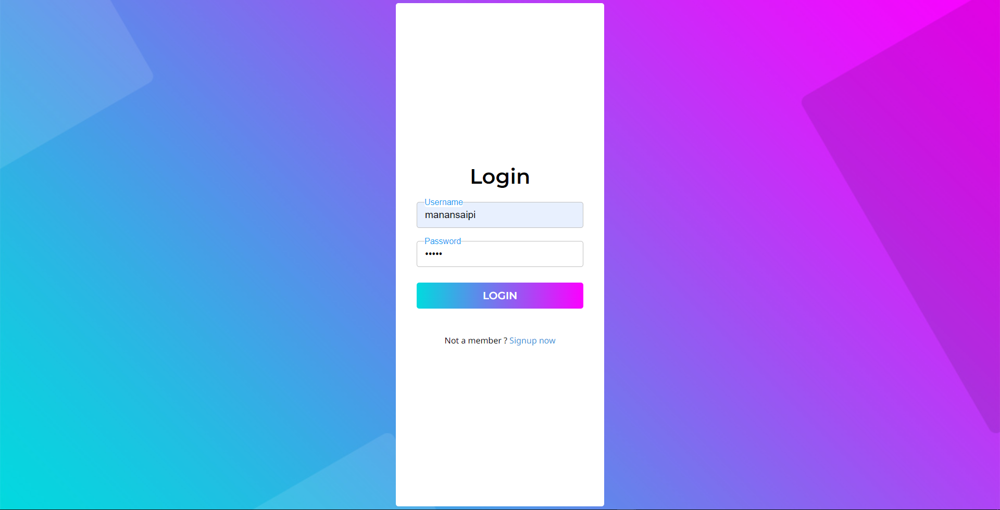
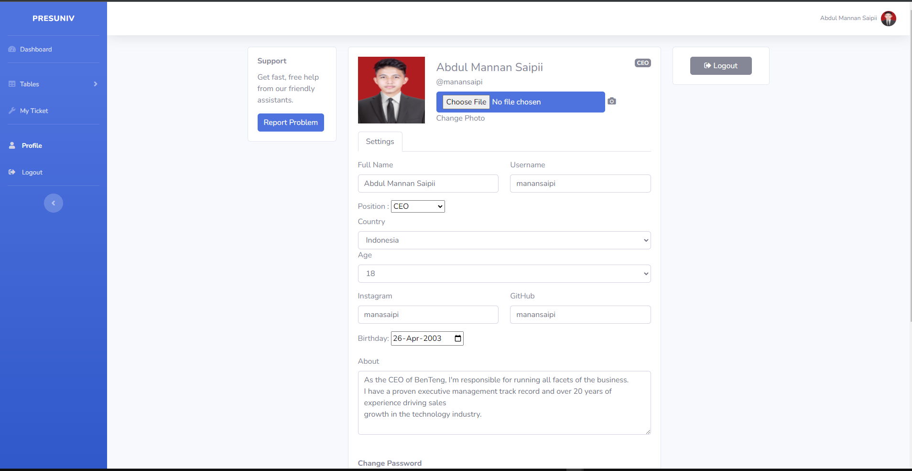
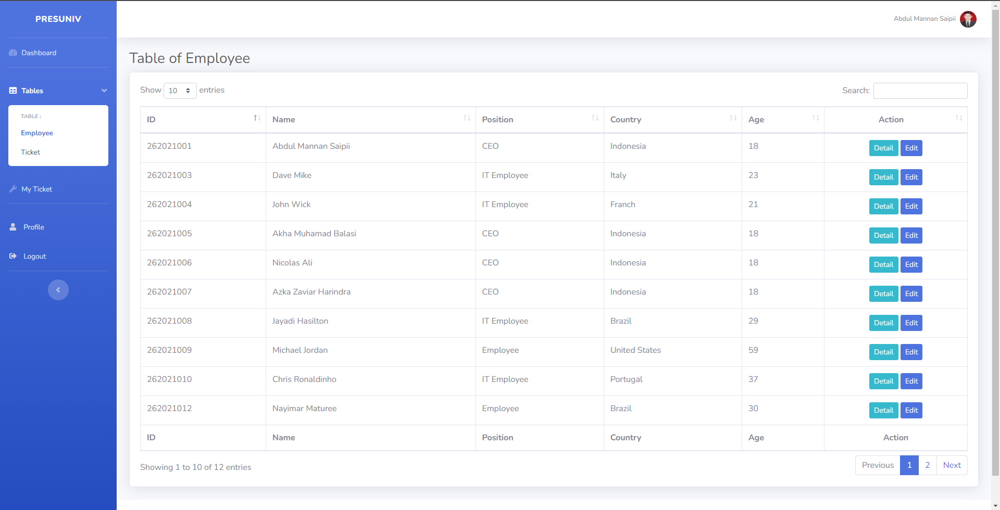
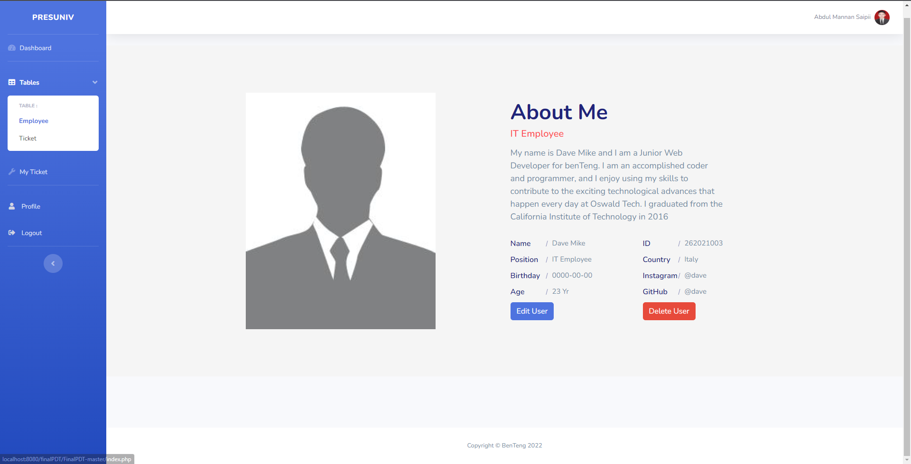
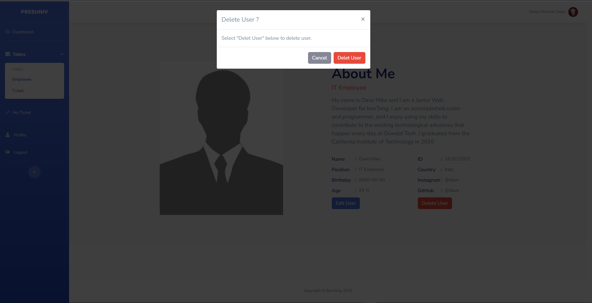
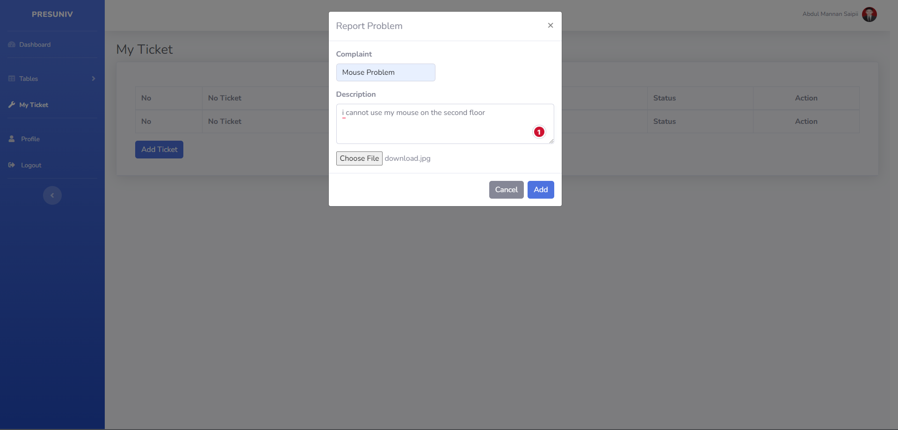
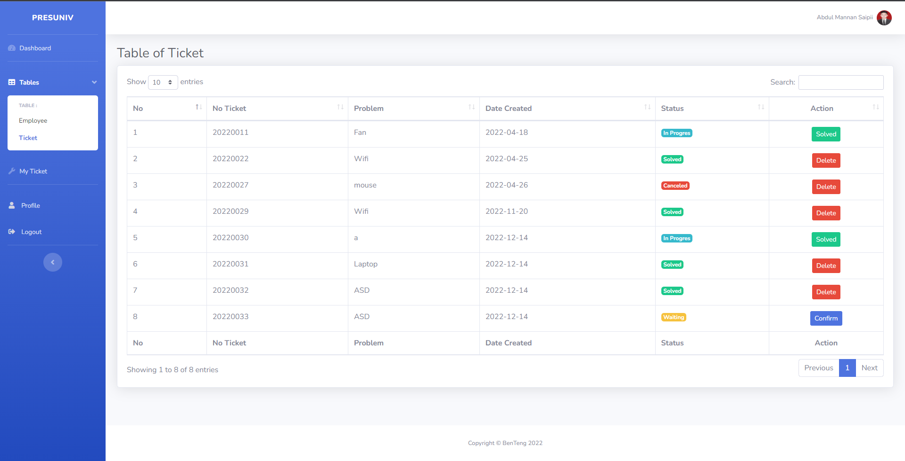
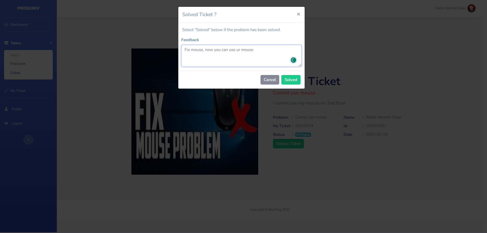
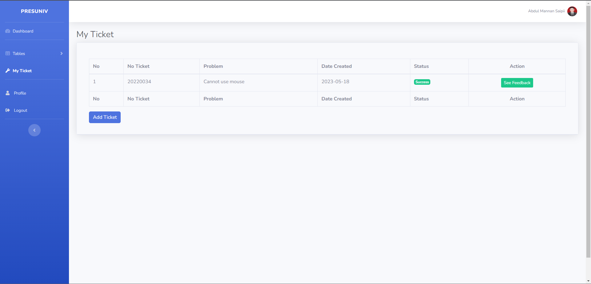

# Ticketing App DEMO
In this demo I log in using Super Admin role/CEO so I can do anything that normal user or Admin can't do. for example Super Admin can edit the Employee profile or delete them but other users can't doing it. Super Admin/CEO and Admin/IT Employee can solved ticket but Employee can't solved ticket. they can only cretae a ticket and wait for CEO or IT Employee to solved their ticket and then Employee can see feedback from CEO or IT Employee who solved their ticket.

| Name  | Description | Preview |
| ------------- | ------------- |------------- |
| Sign up | Users need to Sign up to create an account |  |
| Log in | I log in using Super Admin role or CEO so i can do anything |  |
| Dashboard | After log in Users can see all the information about their ticket |  |
| Profile | Users can update their profile and upload their photo profile |  |
| Table Employee | Super Admin and other users can see all the employee in Table Employee but only Super Admin can make changes to it |  |
| Detail Employee | Super Admin and other users can see the detail of the Employee but only Super Admin/CEO can edit and delete the Employee |  |
| Edit Employee | Super Admin/CEO can edit users or promote users to become an IT Employee or CEO |  |
| Delete Employee | Super Admin/CEO can delete users |  |
| Create Ticket | Users can create a ticket/report a problem and wait to be solved by CEO/IT Employee |  |
| Table Ticket | Super Admin and other users can see al the ticket in Table Ticket but only Super Admin/CEO or Admin/IT Employee can solved the ticket and give a feedback on the ticket |  |
| Solved Ticket | Super Admin/CEO or Admin/IT Employee can solved users ticket and give a feedback to it |  |
| Status Ticket | Users can see their ticket status and after ticket was solved they can see feedback from the CEO or IT Employee who solved the ticket|  |
